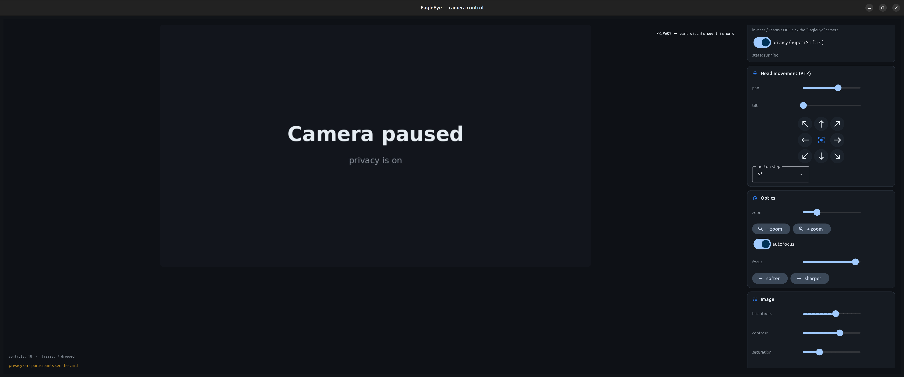
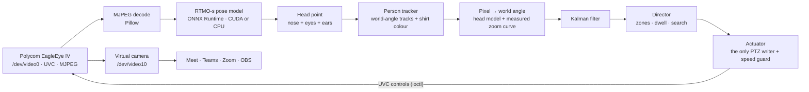
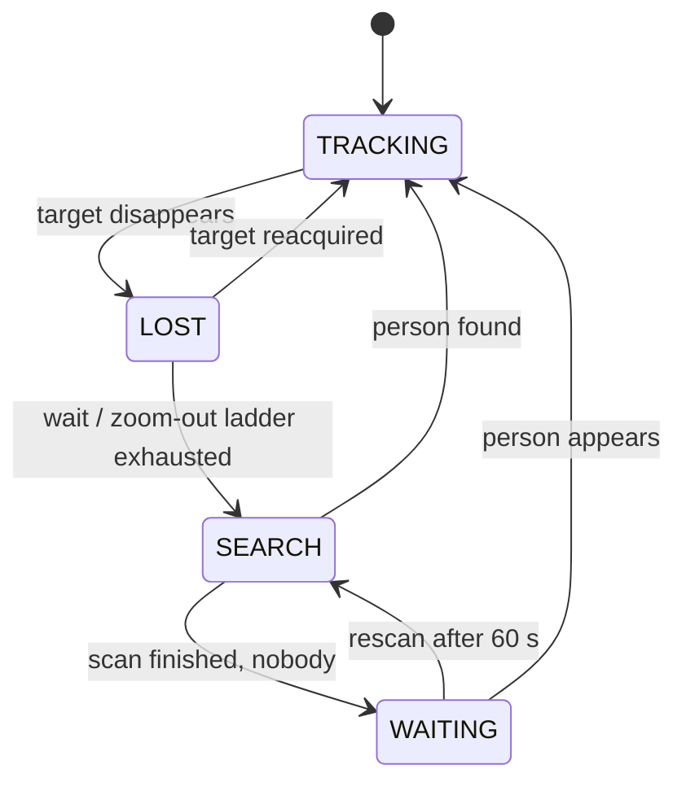
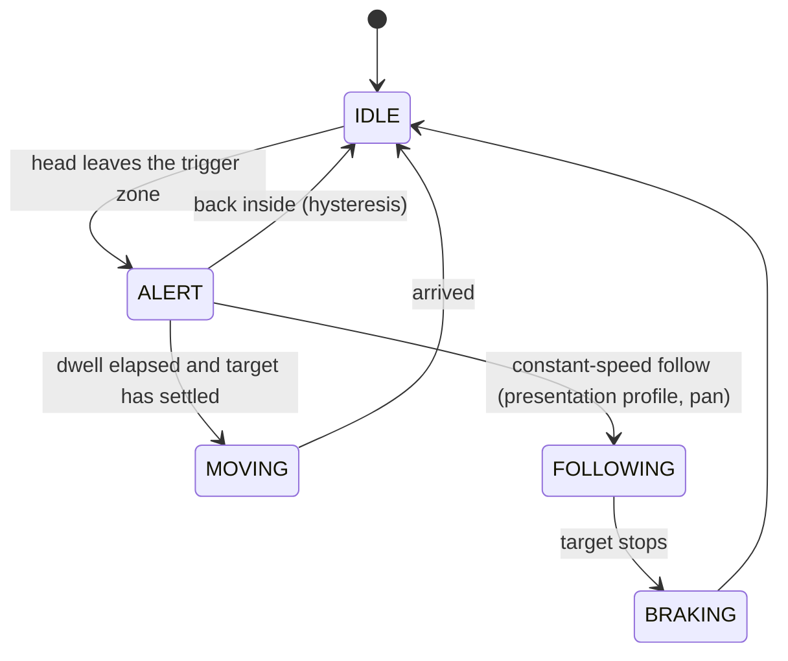
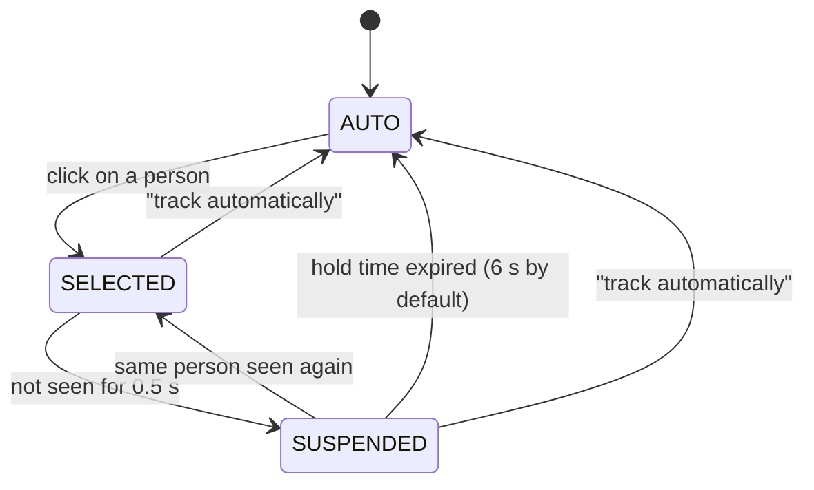

# EagleEye Control

**Pan/tilt/zoom control and AI auto-framing for the Polycom EagleEye IV USB camera on Linux.**

[Polski](README.pl.md) · English


The EagleEye IV is a great motorised camera that works on Linux as a plain UVC 1.10
device, with no vendor driver. What is missing is software that drives the motorised head
and follows you around. EagleEye Control adds both:

- a desktop app with full **PTZ**, zoom, focus, image tuning and presets,
- **auto-tracking** that frames your head like a calm camera operator (rule of thirds,
  no jitter, no hunting),
- a **virtual camera** (`EagleEye`, v4l2loopback) so Meet, Teams, Zoom and OBS receive the
  already-framed picture,
- a **privacy mode** (one shortcut: the lens tilts down and callers see a placeholder),
- **click-to-follow**: with several people in view, click the one the camera should track.

> The UI is available in English and Polish (automatic from your system language, switchable in the app); the command-line verbs are English.

<p align="center">
  
</p>
<p align="center"><em>The app in privacy mode: the preview shows the same card the call participants see.</em></p>

---

## How it works

Everything is built around one idea: **track people in world angles, not in pixels.**
When the camera turns, the whole image moves, and a naive tracker would read that as the
person moving. Here every detection is converted to an angle in the room (camera angle at
the moment the frame was exposed, plus the offset inside the frame), so camera motion
cancels out.

### Pipeline



### Director: what the camera is doing

The director is a state machine with a few modes. When it loses you it does not panic: it
waits where you disappeared, then looks around locally, and only then scans the room.



Each axis (pan, tilt, zoom) has its own small machine, so a camera that is already moving
is never nudged by half-decided commands:



### Choosing who to follow

Every person gets a number from `eagleeye/identity.py` (world-angle tracks plus a colour
histogram of the torso, so numbers survive crossings and short disappearances). Click a
person in the preview, or run `eagleeye select X,Y`.



While suspended, the camera stays where the person vanished, so a stranger walking in
cannot steal the target before the hold time runs out.

### Where the head goes in the frame

The head point is placed on the upper rule-of-thirds line (golden-ratio line, y = 0.382
from the top). With the face to camera the frame is centred horizontally; after the head
turns away for 1.5 s the framing moves once to the opposite intersection so there is
free space in front of the face. At rest the head stays inside a 5 % band around that
point and the camera quietly re-fits after 3 s.

---

## Before you start: the camera needs power

This is the most common reason for "the system does not see my camera". The EagleEye IV
USB is **not powered over USB**.

| | |
|---|---|
| Supply | 12 V DC, at least 1.5 A (original: 3.3 A) |
| Connector | 5.5 mm barrel, 2.5 mm pin |
| **Polarity** | **centre-NEGATIVE** (the middle pin is minus!) |

Check the polarity symbol on the label and **measure the supply with a multimeter**: red
probe on the centre pin, black on the sleeve; it must read **−12 V**. Wrong polarity looks
exactly like a dead camera: no POWER LED, no `lsusb` entry, nothing in `journalctl -k`.

---

## Install

Requires a Debian/Ubuntu-like system with systemd, Python 3, and ideally an NVIDIA GPU
(without one the pose model runs on the CPU at roughly 13–14 Hz instead of 15 Hz+).

```bash
git clone https://github.com/<your-user>/polycom-Eagleeye.git
cd polycom-Eagleeye
./install.sh            # ./install.sh --dry-run shows the steps without doing them
```

The installer is safe to run repeatedly. It:

1. installs `v4l2loopback-dkms`, `gir1.2-ayatanaappindicator3-0.1` and `python3-venv`
   (the only step that asks for `sudo`),
2. sets up the virtual camera "EagleEye" (`/dev/video10`),
3. creates a Python virtualenv (CUDA build when an NVIDIA card is present),
4. downloads the RTMO-s pose model (about 36 MB, from OpenMMLab),
5. adds EagleEye to the app menu and the `eagleeye` command to `~/.local/bin`,
6. enables the `eagleeye-placeholder` user service, which keeps the virtual camera visible in
   Chrome by showing a "EagleEye is not running" slate when the app is closed,
7. binds **Super+Shift+C** to privacy mode.

Uninstall with `./uninstall.sh` (`--all` also removes the venv and kernel module).

## Use

Start **EagleEye** from the app menu. Closing the window hides it to the tray; tracking and
the virtual camera keep running. In Meet, Teams or OBS pick the camera named **EagleEye**,
not "Polycom EagleEye IV USB Camera" (that is the physical device; while a browser holds it,
the app has no picture to track).

| Command | What it does |
|---|---|
| `eagleeye` | start the app or show the running window |
| `eagleeye privacy [on\|off]` | privacy mode: placeholder for callers, lens down (Super+Shift+C) |
| `eagleeye tracking [on\|off]` | auto-tracking on/off |
| `eagleeye profile talk` | tracking profile |
| `eagleeye autozoom [on\|off]` | automatic zoom (no argument: toggle) |
| `eagleeye select X,Y\|none` | follow the person at a frame point, or `none` to go back to automatic (`eagleeye state` → `selection`: people and frame size) |
| `eagleeye state` | state as JSON, including tracking performance (Hz, detection time, frame age) |
| `eagleeye language [auto\|en\|pl]` | UI language |
| `eagleeye quit` | quit |

(`on`/`off` switch a feature explicitly; with no argument the command toggles.) Without installing: `.venv/bin/python -m eagleeye.cli`.

---

## Features

- **PTZ**: eight-way pad plus centre, step sizes of 1°, 5°, 15°, 40°, absolute sliders.
- **Optics**: zoom (slider and buttons), autofocus switch or manual focus.
- **Image**: brightness, contrast, saturation, hue, gamma, sharpness, white balance (auto or
  2500–8000 K), backlight compensation.
- **Presets**: complete camera poses (pan, tilt, zoom, focus), stored in `config.json`.
- **Language**: English and Polish interface, picked up automatically from the system
  language and switchable in the app.
- **Auto-tracking** with two profiles:

| | talk | presentation |
|---|---|---|
| goal | calm: rare, smooth moves | keep up with a walking person |
| status | ready | **experimental** (see below) |
| trigger zone | ±15 % / ±12 % of the frame | ±26 % / ±12 % |
| shot size (auto zoom) | MCU, up to half the frame | MS, down to the waist |
| dwell before moving | 0.8 s | 0.2 s |
| constant-speed follow | no | yes (pan) |
| after losing the person | waits where they vanished | catches up, searches nearby, returns "home" |

- **Auto zoom** picks the shot size from the shoulder-to-eyes distance and moves only on a
  lasting change (≥ 20 %, 2 s, stable target). A manual zoom change (slider, buttons, preset)
  turns it off for good; re-enable it from the tracking panel or `eagleeye autozoom on`.
- **Search**: when tracking starts, the camera scans the room in 60° steps, beginning where
  it last saw someone. "Set home" stores the pose it returns to when nobody is around.

---

## What we measured

The control code is built on measurements of a real camera, not guesses. (Numbers are from
one unit, measured 2026-09-22 to 2026-09-29.)

- **Velocity pan/tilt is on/off.** `Pan/Tilt Speed` is "go / stop": any non-zero value moves
  at a fixed ~40°/s toward its sign, 0 brakes. The magnitude does not matter. After a stop
  the head coasts a further ~5.5°.
- **Absolute moves follow an S-curve** generated by the firmware (Student-t profile,
  correlation 0.92): about 0.4 s plus distance / 67°/s, so 40° takes about 1 s. Tilt is slower
  than pan (0.10 s delay, 0.80 s + distance / 66°/s); a model with pan parameters was off by
  1.6° RMS in motion.
- **The camera does not report where it is looking.** Absolute readback returns the last
  commanded value, and during velocity moves it does not change at all. So the app keeps a
  *head model* of the real angle. With the head still, the world angle of a seated person
  stays within ±0.3°.
- **A linear zoom model was 2–3× off.** A measured zoom curve (`eagleeye/geometry.py`,
  `ZOOM_CURVE`) replaced it, and tracking now moves in steps at the current zoom.
- **One pose model beats two detectors.** The earlier face (YuNet) + body (YOLOX) pair
  shifted the target by 9–13° whenever someone stood up, sat down or turned. RTMO-s keeps it
  within 3–5° on the same clip.
- **Hardware limits**: the camera has no UVC exposure or iris control, so auto-exposure
  saturates on faces in front of a window; the fix is on the scene side.

| Pose model | Time (GPU, RTX 3060 Ti) | Time (CPU) |
|---|---|---|
| RTMO-s ONNX + CUDA, 960×540 frame | **7.8 ms** | 62 ms (p95 74 ms) |

The calibration of this unit (pan, tilt and zoom dynamics) lives in code as the `Dynamics`
defaults in `eagleeye/head_model.py`, independent of `config.json`. To calibrate another unit
use `tools/measure_dynamics.py`, `tools/measure_zoom.py` and `tools/measure_trajectory.py`;
`--save` writes the result as an override in `config.json`.

### Why "presentation" is experimental

The head moves in continuous mode at one fixed speed (~40°/s) while walking is ~20°/s. The
camera can catch up and stop, or wait, but it cannot travel evenly alongside a walking
person. A narrow zone makes it move every ~2 s; a wide one makes it nearly unresponsive.
Smooth following needs a digital crop (a 720p window of the 1080p image follows the head
while the motor only occasionally re-centres the scene); that is the next planned stage.

---

## Project layout

```
app.py                 Flet window = a view of the engine; closing hides to tray
└── eagleeye/
    ├── engine.py      engine: camera, tracking, virtual camera, privacy; independent of the window
    ├── vcam.py        virtual camera "EagleEye": I420, slates, fixed-rate writer thread
    ├── placeholder.py slate service shown when the app is not running
    ├── privacy.py     privacy mode: slate, lens down, restore previous pose
    ├── control.py     UNIX socket: one-line JSON commands, single-instance lock
    ├── cli.py         the `eagleeye` command
    ├── i18n.py        runtime translation: catalogs, fallback chain, language detection
    ├── locales/       interface catalogs (`en.json`, `pl.json`)
    ├── v4l2.py        hardware: MJPEG stream (mmap, frame time), controls (ioctl), loopback output
    ├── detectors.py   RTMO-s pose model (ONNX Runtime CUDA/CPU), MJPEG decoding
    ├── perception.py  head point from pose keypoints
    ├── identity.py    person numbering across frames, click-to-follow selection
    ├── geometry.py    field of view (measured zoom curve), pixel <-> world angle
    ├── head_model.py  where the camera really looks (firmware dynamics)
    ├── target_filter.py  Kalman filter in world angles
    ├── director.py    movement decisions, profiles, search, target loss
    ├── actuator.py    the single PTZ writer + speed guard
    ├── core.py        one pipeline step (shared with the simulator)
    ├── tracker.py     tracking thread, session recorder
    ├── sim.py         camera and scene simulator
    └── config.py      settings and presets (config.json)
tray/                  tray icon (system python3 + AyatanaAppIndicator3)
tools/                 calibration, session replay, V4L2 helpers
tests/                 unit tests, closed-loop simulation, live-camera tests
```

Design decisions worth knowing:

- **No preview recompression.** The camera outputs MJPEG, so JPEG bytes go straight to the
  image widget; frames are decoded only when detections must be drawn.
- **Two device descriptors.** Stream and controls use separate file descriptors so writing a
  control never disturbs capture.
- **One pose model**, not face + body models, so the head point exists in every posture.
- **Control by identification.** Motion bugs are fixed by measuring the plant and the
  estimator, never by widening zones.

## Known limitations

- Detection runs on the GPU (CUDA). Without it the model falls back to the CPU
  automatically; tracking keeps working at about 13–14 Hz.
- Frame decoding uses Pillow instead of OpenCV: the camera adds a few padding bytes before
  the JPEG EOI marker, and OpenCV's libjpeg prints `Corrupt JPEG data` to stderr on every
  frame. Pillow reports it as a silenceable Python warning (~8 ms vs ~5 ms per 720p frame,
  byte-identical output).
- The RJ45 port does nothing on Linux (it was for service use).
- Camera control settings do not persist in the device; only presets in `config.json` do.
- Firmware cannot be updated from Linux.
- Pan/tilt sign convention was measured on one unit (pan positive = right, tilt positive =
  up). The UI has "invert pan" / "invert tilt" switches in case yours differs.
- Several XU unit 14 selectors are write-only service ports; the app never writes them.

## Tests

```bash
for f in tests/test_*.py; do .venv/bin/python "$f" | tail -1; done
```

Tests use a small runner of their own (no pytest). The suite covers geometry, head model,
Kalman filter, director (hysteresis, dwell, search, loss ladder), closed-loop **smoothness
metrics** in a simulator (sitting, walking, searching, escaping), perception, identity and
click-to-follow, engine commands, privacy mode, the control socket, the virtual camera and the
installer (`--dry-run`, shellcheck). `test_tracking_live.py` and `test_vcam_live.py` need real
hardware and a free camera (V4L2 allows one stream client).

## Troubleshooting

**Meet does not list "EagleEye".** Chrome only sees a v4l2loopback device while something is
writing to it, and it builds the camera list at startup. The app or the slate service must be
writing: `systemctl --user status eagleeye-placeholder` should say `active` and
`cat /sys/class/video4linux/video10/state` should say `capture`. If the slate was not running
when Chrome started, open `chrome://restart`. Do not set `exclusive_caps` to 0.

**"camera /dev/video0 is held by: chrome".** You picked the physical camera in Meet. Switch
to "EagleEye"; the app reconnects within 3 s.

**The system does not see the camera.** Check power (first section). `lsusb | grep 095d` should
list `Polycom EagleEye IV USB Camera`.

**The app does not open the camera.** Use `/dev/video0`; `/dev/video1` is metadata only.

**No access to `/dev/video*`.** Usually logind grants it by ACL. Otherwise
`sudo usermod -aG video $USER` and log in again.

**"GPU: unavailable".** `onnxruntime-gpu` or the cuDNN libraries are missing. The app still
works on the CPU.

**Camera moves too often or too rarely.** Adjust the zone and dwell under Auto-tracking →
advanced. Enable "record session" and replay settings offline:
`.venv/bin/python tools/replay_session.py captures/sessions/<file>.jsonl --set dwell=1.2`.

---

## Contributing

Issues and pull requests are welcome, especially measurements from other EagleEye units
(zoom curve, dynamics, pan/tilt sign), which is the most useful way to check that the
calibration is not specific to one device. Run the test suite before sending changes.

To add a language, copy `eagleeye/locales/en.json` to `<code>.json`, translate the values
(keep the `{placeholders}`), set `_name` to the language's own name, and run
`tests/test_catalogs.py`; the app picks the new file up automatically.

## License

[MIT](LICENSE) © 2026 Artur Basiński.

The pose model (RTMO-s, from [OpenMMLab MMPose](https://github.com/open-mmlab/mmpose)) is
**not** part of this repository: the installer downloads it, and it is distributed under
Apache-2.0. The app relies on [Flet](https://flet.dev), OpenCV, NumPy, Pillow and
ONNX Runtime, each under its own permissive license. NVIDIA cuDNN is installed from PyPI and
is subject to NVIDIA's license.

*Polycom and EagleEye are trademarks of their respective owners. This is an independent
community project, not affiliated with or endorsed by Polycom or HP.*
