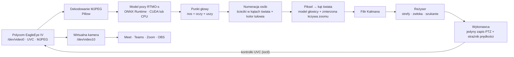
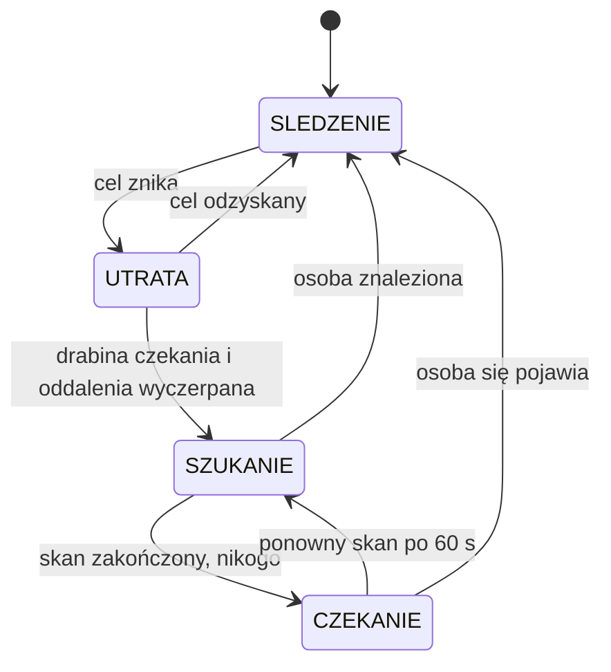
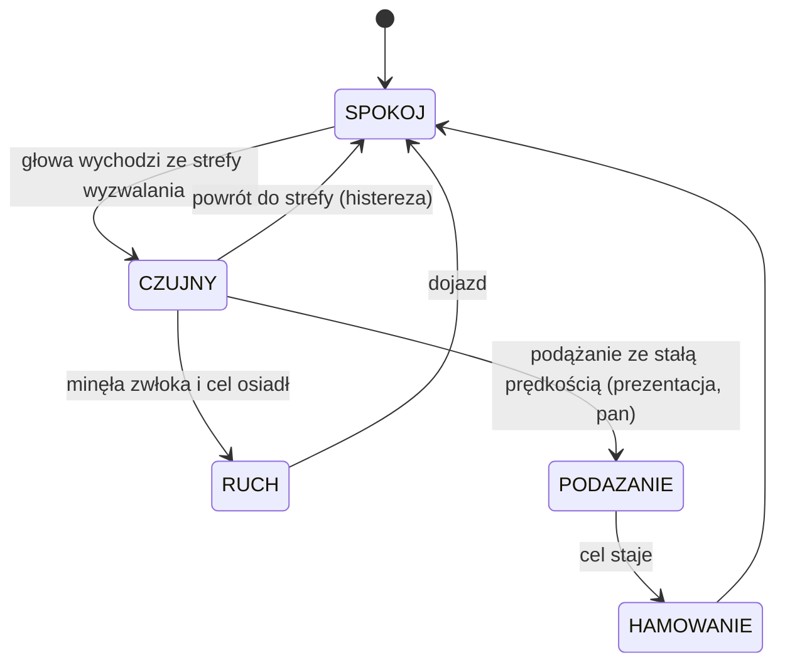
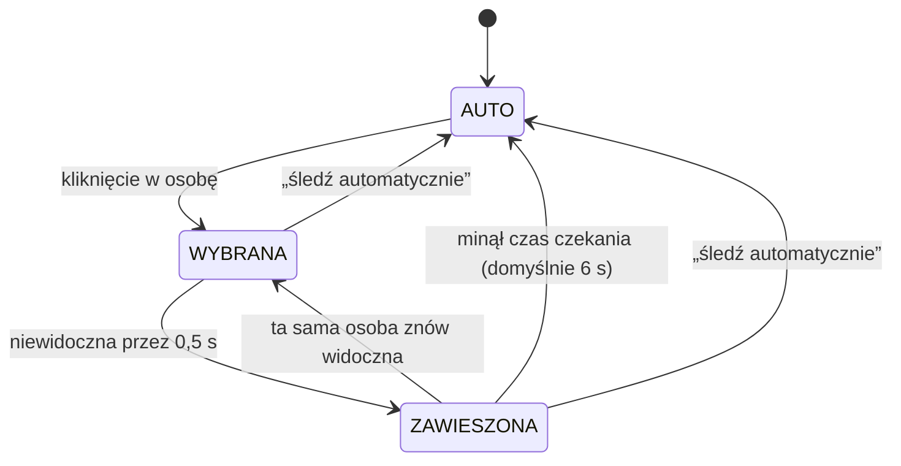

# EagleEye Control — kamera Polycom EagleEye IV USB na Linuksie

[English](README.md) · Polski


Aplikacja desktopowa do sterowania kamerą **Polycom EagleEye IV USB** (`095d:9204`)
przez V4L2: pełny PTZ, zoom, ostrość, korekcja obrazu, presety pozycji oraz
**auto-tracking** osoby (model pozy RTMO-s) liczony na GPU.

Kamera działa w Linuksie jako standardowe urządzenie **UVC 1.10** — nie trzeba
żadnych sterowników producenta. Ta aplikacja dodaje to, czego nie ma w prostych
programach pokroju Cheese: interfejs do ruchomej głowicy i śledzenie obiektu.

Najważniejsze: kadrowanie głowy jak spokojny operator (złoty podział, bez drgań),
**wirtualna kamera** „EagleEye” dla Meet/Teams/Zoom/OBS, **tryb prywatności** pod
jednym skrótem oraz **wybór osoby kliknięciem**, gdy w kadrze jest ich kilka.

> Interfejs jest dostępny po angielsku i polsku (automatycznie z języka systemu, przełączany w aplikacji); polecenia wiersza poleceń są po angielsku.

---

## Schemat działania

Wszystko opiera się na jednym pomyśle: **osoby śledzimy w kątach świata, nie w pikselach.**
Gdy kamera się obraca, cały obraz się przesuwa, a naiwny tracker wziąłby to za ruch
człowieka. Tu każde wykrycie jest przeliczane na kąt w pokoju (kąt kamery w chwili
naświetlenia klatki + przesunięcie w kadrze), więc ruch kamery się znosi.

### Potok



### Reżyser: co robi kamera

Reżyser to automat stanów. Gdy zgubi osobę, nie wpada w panikę: czeka tam, gdzie
zniknęła, potem szuka w pobliżu i dopiero na końcu skanuje cały pokój.



Każda oś (pan, tilt, zoom) ma własny mały automat, więc kamera w ruchu nie dostaje
połowicznych poleceń:



### Wybór osoby do śledzenia

Każda osoba dostaje numer (`eagleeye/identity.py`: ścieżki w kątach świata plus histogram
koloru tułowia, więc numery trzymają się przy skrzyżowaniach i po krótkim zniknięciu).
Kliknij osobę w podglądzie albo użyj `eagleeye select X,Y`.



W stanie „zawieszona” kamera stoi na ostatnim miejscu osoby, więc obcy człowiek nie
przejmie celu przed upływem czasu czekania.

---

## Zanim uruchomisz — kamera musi mieć zasilanie

To najczęstsza przyczyna „kamera nie działa i system jej nie widzi".
EagleEye IV USB **nie jest zasilana z USB** — wymaga zewnętrznego zasilacza:

| Parametr | Wartość |
|---|---|
| Napięcie / prąd | 12 V DC, ≥ 1.5 A (oryginał 3.3 A) |
| Wtyk | 5.5 mm barrel / 2.5 mm pin |
| **Biegunowość** | **center-NEGATIVE** (środek = **minus**!) |

Sprawdź symbol polaryzacji na tabliczce kamery i **zmierz zasilacz multimetrem**:
czerwona sonda w środek wtyku, czarna na tuleję → ma pokazać **−12 V**.
Odwrotna biegunowość daje dokładnie taki objaw jak „martwa kamera": brak diody
POWER, brak zdjęć i **zerowa aktywność w `lsusb`/`journalctl -k`**.

Szybka diagnostyka bez rozkręcania: podłącz 12 V, wepnij RJ45 do switcha —
jeśli dioda linku nie świeci, prąd nie dochodzi do kamery.

---

## Instalacja

```bash
git clone https://github.com/<twoj-uzytkownik>/polycom-Eagleeye.git
cd polycom-Eagleeye
./install.sh
```

Instalator (bezpieczny do ponownego uruchomienia; `./install.sh --dry-run` pokazuje kroki
bez wykonywania):

1. doinstalowuje `v4l2loopback-dkms`, `gir1.2-ayatanaappindicator3-0.1`, `python3-venv`
   (jedyne miejsce, gdzie prosi o hasło sudo),
2. konfiguruje wirtualną kamerę „EagleEye” (`/dev/video10`),
3. tworzy środowisko Pythona (z CUDA, gdy jest karta NVIDIA),
4. pobiera model pozy RTMO-s,
5. dodaje „EagleEye” do menu i polecenie `eagleeye` (`~/.local/bin`),
6. włącza usługę `eagleeye-placeholder` (systemd `--user`, od zalogowania): gdy aplikacja
   nie działa, wirtualna kamera pokazuje planszę „EagleEye nie działa” — dzięki temu
   Chrome zawsze ma „EagleEye” na liście kamer, niezależnie od kolejności uruchamiania,
7. przypisuje skrót **Super+Shift+C** do trybu prywatności.

Odinstalowanie: `./uninstall.sh` (`--all` usuwa też venv i moduł).

## Uruchamianie

Z menu: **EagleEye**. Zamknięcie okna chowa je do zasobnika — kamera wirtualna i śledzenie
działają dalej; pełne zamknięcie: *Zakończ* w menu ikony.

W Meet, Teams albo OBS wybierz kamerę **EagleEye** — nie „Polycom EagleEye IV USB Camera”
(to kamera fizyczna; gdy trzyma ją przeglądarka, aplikacja nie ma obrazu do śledzenia).
Podgląd w Meet jest dla Ciebie lustrzany; uczestnicy widzą obraz prawidłowo, tak jak w oknie.

| Polecenie | Działanie |
|---|---|
| `eagleeye` | uruchom albo pokaż okno działającej aplikacji |
| `eagleeye privacy [on\|off]` | prywatność: plansza dla uczestników, obiektyw w dół (Super+Shift+C) |
| `eagleeye tracking [on\|off]` | auto-tracking |
| `eagleeye profile talk` | profil śledzenia |
| `eagleeye autozoom [on\|off]` | zoom automatyczny (bez argumentu: przełącz) |
| `eagleeye select X,Y\|none` | śledź osobę w punkcie klatki albo wróć do trybu automatycznego (`eagleeye state` → `selection`: osoby i rozmiar klatki) |
| `eagleeye state` | stan w JSON (z wydajnością śledzenia: Hz, detekcja, wiek klatki, ruchy) |
| `eagleeye language [auto\|en\|pl]` | język interfejsu |
| `eagleeye quit` | zamknij aplikację |

Tryb deweloperski bez instalacji: `.venv/bin/python -m eagleeye.cli`.

## Co potrafi

**Połączenie** — wybór urządzenia i rozdzielczości podglądu (640×360 … 1920×1080),
liczba klatek, rysowanie wykryć na obrazie.

**Ruch głowicy (PTZ)** — panel kierunkowy (8 kierunków + wyśrodkowanie), wybór kroku
(1° / 5° / 15° / 40°), suwaki pozycji bezwzględnej.

**Optyka** — zoom (suwak + przyciski + tryb ciągły), ostrość z przełącznikiem
autofocusa i regulacją ręczną.

**Obraz** — jasność, kontrast, nasycenie, odcień, gamma, ostrość, balans bieli
(auto lub temperatura 2500–8000 K), kompensacja podświetlenia.

**Presety** — zapis i odczyt kompletnych pozycji kamery (pan, tilt, zoom, ostrość),
trzymane w `config.json`.

**Język** — interfejs po angielsku i polsku; wybierany automatycznie z języka systemu,
przełączany w aplikacji.

**Auto-tracking** — kamera kadruje na głowę jak spokojny operator. Dwa profile:

| | talk (rozmowa) | presentation (prezentacja) |
|---|---|---|
| cel | spokój: rzadkie, płynne ruchy | nadążanie za idącą osobą |
| stan | gotowy | **eksperymentalny** — patrz niżej |
| strefa wyzwalania | ±15% / ±12% kadru | ±26% / ±12% |
| plan (zoom automatyczny) | MCU — do połowy klatki | MS — do pasa |
| zwłoka przed ruchem | 0,8 s | 0,2 s |
| podążanie ze stałą prędkością | nie | tak (pan) |
| po zgubieniu osoby | czeka w miejscu, gdzie zniknęła | dogania, szuka w pobliżu, wraca do „domu” |

**Kadrowanie według złotego podziału.** Punkt głowy trafia na górną linię złotego
podziału (y = 0,382 od góry). Twarz na wprost — środek kadru w poziomie; po trwałym
odwróceniu głowy (1,5 s) kadr przechodzi jednym ruchem do punktu przecięcia po
przeciwnej stronie, żeby przed twarzą zostało wolne miejsce. Nakładka pokazuje linie
złotego podziału, ich cztery punkty przecięcia i czerwony pierścień — punkt, w który
kamera kadruje głowę (zielona kropka). W spoczynku głowa zostaje w paśmie 5% wokół tego
punktu; po przesunięciu się kamera cicho poprawia kadr po 3 s.

**Zoom automatyczny** dobiera przybliżenie do planu profilu (wielkość odcinka oczy→barki)
i rusza dopiero przy trwałej zmianie odległości (≥ 20%, 2 s, cel stabilny). Ręczna zmiana
zoomu (suwak, przyciski, preset, pilot) wyłącza automat na stałe — włącza go przełącznik
w panelu śledzenia albo `eagleeye autozoom on`.

**Sterowanie ruchem.** Ruch absolutny głowicy trafia jednym rozkazem tylko w cel, który
stoi, więc reżyser rusza, gdy osoba osiądzie (prędkość < 2°/s) — chyba że za chwilę
wyszłaby z kadru. Filtr Kalmana ma parametry wyznaczone metodą największej
wiarygodności z nagranych sesji, a pomiar z klatki zrobionej w trakcie jazdy kamery
dostaje większą wariancję (niepewność chwili naświetlenia × prędkość kamery).

Po włączeniu śledzenia kamera sama szuka osoby (skan co 60°, zaczynając od
miejsca, w którym ostatnio ją widziała). Przycisk „ustaw dom” zapamiętuje
pozycję, do której kamera wraca, gdy nikogo nie ma. Wartości w sekcji
„zaawansowane” (strefy, zwłoka) nadpisują profil.

**Dlaczego profil „presentation” jest eksperymentalny.** Głowica jeździ w trybie ciągłym
z jedną stałą prędkością (~40°/s), a chód to ~20°/s — kamera może dogonić i stanąć
albo czekać, ale nie pojedzie równo z idącą osobą. Wąska strefa daje ruszenie co
~2 s, szeroka — kamerę, która prawie nie reaguje. Płynne nadążanie wymaga
cyfrowego kadru (wycinek 720p z obrazu 1080p podąża za głową, mechanika tylko
co jakiś czas przesuwa scenę) — to następny etap projektu.

Detekcja głowy — jeden model pozy (RTMO-s); punkt głowy to średnia widocznych
punktów nosa, oczu i uszu, więc istnieje przodem, w profilu, stojąc i tyłem:

| Model | Czas (GPU, RTX 3060 Ti) | Czas (CPU) |
|---|---|---|
| RTMO-s ONNX + CUDA, klatka 960×540 | **7,8 ms** | 62 ms (p95 74 ms) |

Bez GPU pętla śledzenia zwalnia do ~13–14 Hz (budżet 15 Hz to 66 ms).

### Jak to działa i co zmierzyliśmy

Śledzenie liczy położenie głowy w **kątach świata** (kąt kamery w chwili
powstania klatki + przesunięcie w kadrze), więc obrót kamery nie wygląda jak
ruch osoby. Kąt kamery pochodzi z **modelu głowicy**, bo odczyt z kamery zwraca
pozycję zadaną, a w trakcie ruchu prędkościowego nie zmienia się wcale.
Na kamerze: gdy głowica stoi, kąt świata siedzącej osoby trzyma się w ±0,3°.

Pomiary na tym egzemplarzu (2026-09-22/23):

* `Pan/Tilt Speed` to ruch względny „jedź/stój”: wartość ≠ 0 jedzie w stronę
  znaku, 0 hamuje. **Wielkość nie ma znaczenia** — prędkość jest stała, ~40°/s.
  Dawniejsze założenie, że 0 to „najwolniejszy bieg”, było błędne: wpis 15 przy
  połączeniu był rozkazem „jedź w prawo”. Aplikacja zeruje te kontrolki na starcie.
* Po rozkazie stop głowica przejeżdża jeszcze ~5,5°. Pan zawraca w locie, tilt nie.
* Ruch absolutny: firmware sam robi krzywą S (profil t-Studenta, korelacja +0.92);
  czas ~0,4 s + odległość / 67°/s (40° w ~1 s). Rozkaz równy ostatnio zadanemu
  jest ignorowany; po ruchach względnych rozkaz absolutny wraca co do 0,02°.
* Dawniej punkt głowy pochodził z dwóch modeli: twarzy (YuNet) i sylwetki (YOLOX),
  gdy twarzy nie widać. Przełączanie między nimi przesuwało cel o 9–13° przy
  wstawaniu, siadaniu i odwracaniu się, a kamera ruszała bez powodu. Model pozy
  RTMO-s w tych samych chwilach: najwyżej 3–5° (porównanie na nagranym klipie).

* Tilt ma własną trajektorię ruchu absolutnego — wolniejszą niż pan (2026-09-26):
  opóźnienie 0,10 s, czas 0,80 s + odległość / 66°/s. Model z parametrami pan mylił
  się w trakcie jazdy o 1,6° RMS i tilt dojeżdżał na raty.

**Wybór osoby do śledzenia.** Gdy w kadrze jest kilka osób, kliknij tę, którą kamera ma
prowadzić. Osoby dostają numery (`eagleeye/identity.py`): ścieżki liczone w kątach świata
plus histogram koloru tułowia, więc numery trzymają się przy skrzyżowaniach i po krótkim
zniknięciu. Wybrana osoba, która zniknie, jest „zawieszona”: kamera stoi na jej ostatnim
miejscu i czeka do `select_hold_s` (domyślnie 6 s, suwak „czekanie na wybraną”), po czym
wraca do największej osoby. Obcy człowiek nie przejmuje celu przed upływem tego czasu.
Przycisk „śledź automatycznie” (albo `eagleeye select none`) czyści wybór.

Kalibracja tego egzemplarza (dynamika pan, tilt i zoomu) jest wpisana w kod jako wartości
domyślne `Dynamics` w `eagleeye/head_model.py` — nie zależy od `config.json`. Inny
egzemplarz zmierzysz `tools/measure_dynamics.py`, `tools/measure_zoom.py` i
`tools/measure_trajectory.py`; `--save` zapisuje wynik jako nadpisanie w `config.json`.

---

## Jak to działa

```
app.py                 okno Flet = widok silnika; zamknięcie chowa do zasobnika
└── eagleeye/
    ├── engine.py      silnik: kamera, śledzenie, wirtualna kamera, prywatność - niezależny od okna
    ├── vcam.py        wirtualna kamera "EagleEye": I420, plansze, wątek zapisu w stałym tempie
    ├── placeholder.py zaślepka (usługa eagleeye-placeholder): plansza, gdy aplikacja nie działa
    ├── privacy.py     tryb prywatności: plansza, obiektyw w dół, powrót do stanu sprzed
    ├── control.py     gniazdo UNIX: polecenia JSON w jedną linię, blokada jednej instancji
    ├── cli.py         polecenie `eagleeye`: start albo sterowanie działającą aplikacją
    ├── i18n.py        tłumaczenia: `t()`, katalogi komunikatów, wykrywanie języka
    ├── locales/       katalogi interfejsu (`en.json`, `pl.json`)
    ├── trayproc.py    ikona w zasobniku jako proces potomny (systemowy python3)
    ├── v4l2.py        sprzęt: strumień MJPEG (mmap, czas klatki), kontrolki (ioctl), wyjście loopback
    ├── detectors.py   detekcja: model pozy RTMO-s (ONNX Runtime CUDA/CPU), dekodowanie MJPEG
    ├── perception.py  punkt głowy celu z punktów pozy (nos, oczy, uszy)
    ├── identity.py    numery osób między klatkami (ścieżki w kątach świata + kolor ubrania), wybór osoby do śledzenia
    ├── geometry.py    pole widzenia (zmierzona krzywa zoomu), piksel <-> kąt świata
    ├── head_model.py  gdzie kamera naprawdę patrzy (dynamika firmware'u)
    ├── target_filter.py  Kalman w kątach świata
    ├── director.py    decyzje o ruchu, profile, szukanie, utrata celu
    ├── actuator.py    jedyny zapis PTZ + strażnik prędkości
    ├── core.py        jeden krok potoku (wspólny z symulatorem)
    ├── tracker.py     wątek śledzenia, rejestrator sesji
    ├── sim.py         symulator kamery i sceny
    └── config.py      ustawienia i presety (config.json)
tray/                  ikona w zasobniku (systemowy python3 + AyatanaAppIndicator3)
assets/                ikony aplikacji i zasobnika (SVG)
tools/                 kalibracja dynamiki, odtwarzanie sesji, narzędzia V4L2
tests/                 testy jednostkowe, symulacja zamkniętej pętli, testy na kamerze
captures/              (lokalnie, poza repozytorium) nagrane sesje śledzenia i zrzuty
```

Kluczowe decyzje projektowe:

* **Podgląd bez rekompresji** — kamera oddaje MJPEG, więc bajty JPEG trafiają
  wprost do kontrolki `Image`. Serwer dekoduje obraz tylko wtedy, gdy ma narysować
  wykrycia.
* **Dwa deskryptory urządzenia** — strumień i kontrolki używają osobnych
  deskryptorów, żeby zapis kontrolki nie zakłócał przechwytywania.
* **Jeden model detekcji** — RTMO-s daje punkty głowy w każdej pozycji, więc nie ma
  przełączania między modelami twarzy i sylwetki (dawniej źródło skoków celu 9–13°).

---

## Znane ograniczenia

* **Detekcja idzie przez GPU (CUDA).** Bez CUDA model pozy schodzi na CPU
  automatycznie (62 ms na klatkę zamiast 7,8 ms) — śledzenie działa dalej,
  tylko wolniej (~13–14 Hz).
* **Dekodowanie ramek idzie przez Pillow, nie przez OpenCV.** Kamera dokłada kilka
  bajtów dopełnienia przed znacznikiem EOI, a libjpeg w OpenCV wypisuje wtedy
  `Corrupt JPEG data: N extraneous bytes` **na stderr przy każdej klatce**
  (kilkadziesiąt linii na sekundę — poziomów logowania OpenCV to nie tłumi, bo
  komunikat idzie wprost z libjpeg). Pillow zgłasza to jako ostrzeżenie Pythona,
  które da się wyciszyć. Koszt to ~8 ms na klatkę 720p zamiast ~5 ms, a wynik jest
  identyczny co do bajtu. Dodatkowo podgląd dekoduje obraz tylko wtedy, gdy ma co
  rysować — przy braku wykryć bajty JPEG lecą do kontrolki wprost.
* **Port RJ45 nie ma funkcji na Linuksie.** Nie ma go nawet w dokumentacji
  producenta („I/O: USB 2.0") — służył do celów serwisowych.
* **Ustawienia kontrolek nie są trwałe w kamerze.** Po odłączeniu wracają do
  wartości z urządzenia; trwałe są tylko presety zapisane w `config.json`.
* **Aktualizacja firmware niewykonalna** — Polycom udostępnia ją wyłącznie
  przez swoje kodki. Kamera pracuje na wersji, z którą przyszła.
* **Konwencja pan/tilt zmierzona na tym egzemplarzu** (pan dodatni = w prawo,
  tilt dodatni = w górę). Gdyby firmware zachowywał się inaczej, w interfejsie są
  przełączniki „odwróć pan" / „odwróć tilt".

---

## Testy

```bash
for f in tests/test_*.py; do .venv/bin/python "$f" | tail -1; done
```

| Plik | Co sprawdza |
|---|---|
| `test_geometry.py`, `test_head_model.py`, `test_target_filter.py` | przeliczenia kątów, model głowicy, filtr |
| `test_director.py`, `test_director_search.py` | histereza, zwłoka, podążanie, skan, drabina utraty celu |
| `test_actuator.py`, `test_tracker.py` | zapisy do kamery, strażnik prędkości, bezpieczeństwo wątku |
| `test_sim.py` | **miary płynności** w zamkniętej pętli (siedzenie, chodzenie, szukanie, ucieczka) |
| `test_perception.py`, `test_detectors.py`, `test_motion.py` | punkt głowy, detekcja, dekodowanie, krzywa S |
| `test_identity.py`, `test_preview_click.py` | numery osób, wybór i zawieszenie celu, kliknięcie w podgląd |
| `test_engine.py`, `test_privacy.py` | silnik: polecenia, stan; prywatność: plansza, obiektyw w dół, powrót |
| `test_control.py`, `test_cli.py` | gniazdo sterujące (protokół, jedna instancja) i polecenie `eagleeye` |
| `test_vcam.py`, `test_vcam_live.py` | wirtualna kamera: I420, plansze, stałe tempo; na sprzęcie: odczyt z `/dev/video10` |
| `test_placeholder.py` | zaślepka: plansza bez aplikacji, oddanie i przejęcie urządzenia |
| `test_tray.py` | ikona w zasobniku: logika menu, proces potomny z ponowną próbą |
| `test_install.py` | instalator: składnia bash, `--dry-run` bez zmian, shellcheck |
| `test_tracking_live.py` | **prawdziwa kamera**: strażnik i powrót po ruchu prędkościowym |

`test_detectors.py` dociąga obraz referencyjny (messi5 z osobą) z repozytorium
próbek OpenCV do `models/testdata/`. Bez sieci albo bez pliku modelu testy zależne
od nich zgłaszają pominięcie, zamiast udawać, że coś sprawdziły.

`test_tracking_live.py` wymaga **wolnej kamery** (V4L2 pozwala na jednego klienta
strumienia) i kadru z teksturą; w pokoju nie musi być człowieka. Pozycja kamery
jest przywracana na końcu.

---

## Rozwiązywanie problemów

**Meet nie widzi kamery „EagleEye”** — Chrome widzi urządzenie v4l2loopback tylko wtedy,
gdy ktoś do niego pisze, a listę kamer buduje przy starcie (zdarzenia udev jej nie
odświeżają). Pisze aplikacja albo zaślepka: `systemctl --user status eagleeye-placeholder`
ma pokazać `active`, a `cat /sys/class/video4linux/video10/state` — `capture`. Jeśli
zaślepka nie działała, gdy Chrome startował: `chrome://restart`. Nie zmieniaj
`exclusive_caps` na 0 — Chrome pomija urządzenia z jednocześnie wejściem i wyjściem.
Karta „Wirtualna kamera” w oknie pokazuje stan; „brak urządzenia” oznacza, że trzeba
uruchomić `./install.sh` (albo zrestartować komputer, jeśli instalator o tym informował).

**„kamerę /dev/video0 zajmuje: chrome”** — w Meet wybrano kamerę fizyczną. Przełącz na
„EagleEye”; aplikacja połączy się sama w ciągu 3 s.

**Śledzenie dojeżdża „na raty” przy zoomie** — przeliczenie piksel → kąt korzysta ze
zmierzonej krzywej zoomu (`eagleeye/geometry.py`, `ZOOM_CURVE`). Inny egzemplarz kamery
może mieć inną krzywą; `eagleeye state` pokazuje liczbę ruchów, a zapis sesji
(`"record": true` w `config.json`) — szacunek pozycji przed i po każdym ruchu.

**System nie widzi kamery** — sprawdź zasilanie (patrz pierwsza sekcja).
`lsusb | grep 095d` ma pokazać `Polycom EagleEye IV USB Camera`.
Przy braku zasilania `journalctl -k` jest całkowicie milczący.

**Kamera jest, ale aplikacja jej nie otwiera** — upewnij się, że wybrałeś
`/dev/video0`. Węzeł `/dev/video1` to tylko metadane i nie da się z niego
nagrywać (aplikacja sama to rozpoznaje i zgłasza).

**Brak dostępu do `/dev/video*`** — zwykle nie trzeba nic robić, bo logind nadaje
uprawnienia przez ACL. Gdyby jednak brakowało: `sudo usermod -aG video $USER`
i ponowne zalogowanie.

**„GPU: niedostępne"** — brak `onnxruntime-gpu` albo bibliotek cuDNN.
Zainstaluj zgodnie z sekcją GPU; aplikacja i tak będzie działać na CPU.

**Kamera rusza za często / za rzadko** — w karcie Auto-tracking → „zaawansowane”
zmień strefę i zwłokę. Włącz „zapisuj sesję” i porównaj nastawy bez stania przed
kamerą: `.venv/bin/python tools/replay_session.py captures/sessions/<plik>.jsonl --set dwell=1.2`.

---

## Współpraca

Zgłoszenia i pull requesty są mile widziane, zwłaszcza pomiary z innych egzemplarzy
EagleEye (krzywa zoomu, dynamika, znak pan/tilt) — to najlepszy sposób, by sprawdzić,
czy kalibracja nie jest specyficzna dla jednego urządzenia. Przed wysłaniem zmian
uruchom testy.

Aby dodać język, skopiuj `eagleeye/locales/en.json` do `<kod>.json`, przetłumacz wartości
(zachowaj `{placeholdery}`), ustaw `_name` na nazwę języka w nim samym i uruchom
`tests/test_catalogs.py`; aplikacja podchwyci nowy plik automatycznie.

## Licencja

[MIT](LICENSE) © 2026 Artur Basiński.

Model pozy (RTMO-s z [OpenMMLab MMPose](https://github.com/open-mmlab/mmpose)) **nie jest**
częścią repozytorium: pobiera go instalator, a rozpowszechniany jest na licencji Apache-2.0.
Aplikacja korzysta z [Flet](https://flet.dev), OpenCV, NumPy, Pillow i ONNX Runtime — każde
na własnej, liberalnej licencji. Biblioteki NVIDIA cuDNN instalowane są z PyPI i podlegają
licencji NVIDIA.

*Polycom i EagleEye są znakami towarowymi ich właścicieli. To niezależny projekt
społeczności, niepowiązany z firmą Polycom ani HP i przez nie niezatwierdzony.*
